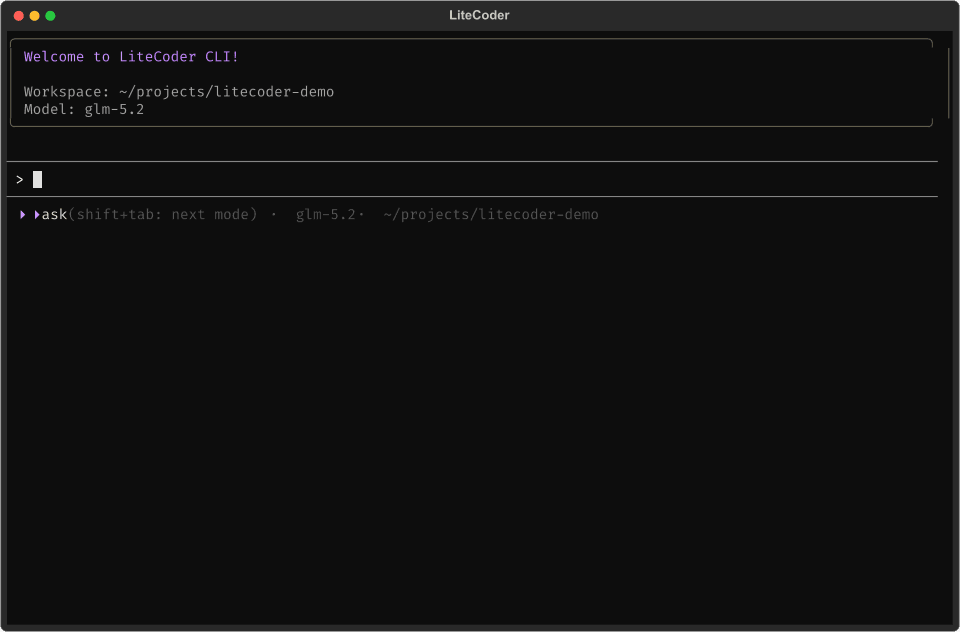
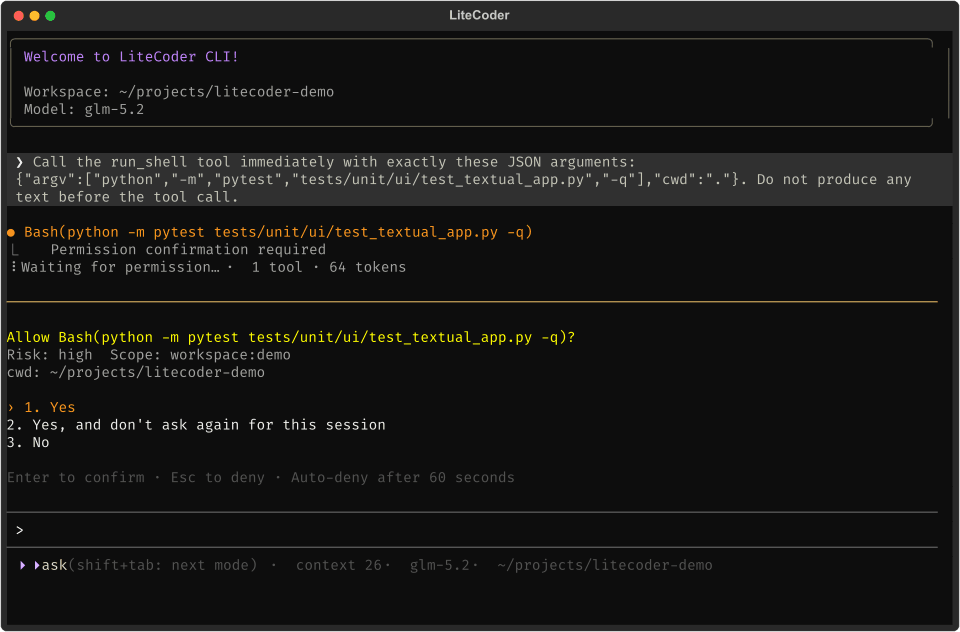
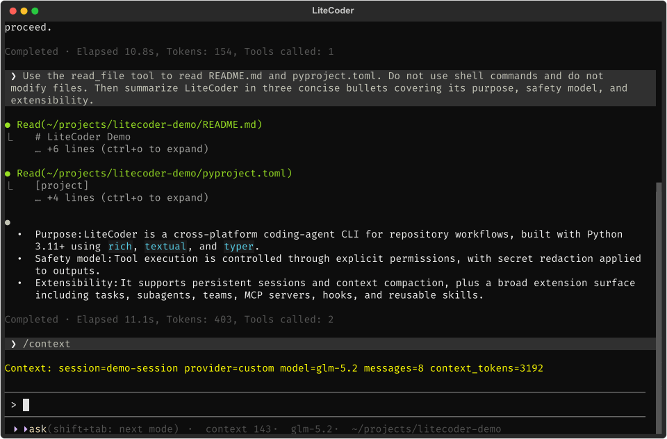

<h1 align="center">LiteCoder</h1>

<p align="center"><strong>面向终端工作流的实用型跨平台编码代理。</strong></p>

<p align="center">
  <a href="README.md">English</a> |
  <a href="README.zh-CN.md">中文</a>
</p>

LiteCoder 是一个面向代码仓库级软件开发的 Python 编码代理 CLI。它将流式终端界面与内置开发工具、持久会话、上下文管理、长期记忆、多代理协作和可扩展集成组合在一起。

<p align="center">
  
</p>

<p align="center"><sub>使用真实 API 连续录制于同一个会话；本地路径和内部标识已脱敏。</sub></p>

## 核心特性

- **终端优先** — 使用交互式界面、执行单次提示词，或恢复之前的会话。
- **灵活的模型服务** — 通过 Anthropic Messages、OpenAI Chat Completions 或 OpenAI Responses 兼容接口连接模型服务。
- **受控工具执行** — 对工作区修改和外部副作用应用显式权限，并在整个运行时中脱敏密钥。
- **上下文管理** — 持久化对话、跟踪 Token 预算，并自动或按需压缩长会话。
- **项目长期记忆** — 将工作区知识保存为可读的 Markdown，并在后续对话中加载相关记忆。
- **多代理协作** — 协调任务、子代理、团队、后台工具、消息通信和隔离的 Git worktree。
- **可扩展运行时** — 无需修改代理循环即可接入 MCP 服务、生命周期 Hooks 和项目级或用户级 Skills。

## 快速开始

LiteCoder 需要 Python 3.11 或更高版本，以及支持的模型服务对应的 API Key。

在项目根目录安装 LiteCoder、Provider 和 MCP 支持：

```bash
python -m pip install ".[providers,mcp]"
```

将 [`config.example.toml`](config.example.toml) 复制到 `~/.litecoder/config.toml`，然后配置 Provider 和模型：

```toml
default_provider = "custom"

[providers.custom]
type = "openai-chat-completions"
base_url = "https://your-provider.example/v1"
model = "your-model"
api_key = "your-api-key"
```

根据服务端暴露的接口，将 `type` 设置为 `anthropic-messages`、`openai-chat-completions` 或 `openai-responses`。官方接口和第三方兼容接口使用相同配置路径。也可以在定义 Provider 后单独保存 API Key：

```bash
litecoder config set-key custom
```

进入需要处理的代码仓库并启动 LiteCoder：

```bash
litecoder
```

## 使用方式

### CLI

```bash
# 在新会话中执行一次提示词
litecoder run "检查这个代码仓库并总结其架构"

# 恢复现有会话
litecoder resume <session-id>

# 查看持久化状态
litecoder sessions list
litecoder sessions show <session-id>
litecoder tasks list
litecoder tasks show <task-id>

# 查看运行追踪和集成
litecoder trace <session-id>
litecoder mcp list
litecoder mcp tools
litecoder mcp test
```

使用 `litecoder --help` 或 `litecoder <command> --help` 查看完整命令语法。

### 交互式命令

- `/compact` 压缩当前会话上下文。
- `/context` 查看有效上下文和 Token 使用情况。
- `/memory [name]` 查看工作区记忆。
- `/model [provider] [model]` 查看或切换当前模型。
- `/tasks [task-id]` 列出任务或查看指定任务。
- `/trace` 显示 Trace 与命令审计文件位置。
- `/clear` 创建新的持久化会话上下文。
- `/help` 和 `/exit` 显示帮助或退出界面。

## 工作原理

**权限与追踪。** 安全读取可以自动执行，工作区修改、外部操作以及要求确认的工具则由权限服务检查。每个根会话都会生成 JSONL Trace，本地命令会写入持久审计日志，已配置的密钥会从 UI 输出、诊断信息、Trace 和工具结果中脱敏。

**上下文管理与记忆。** 会话和消息存储在 `~/.litecoder/sessions.db`。LiteCoder 根据 Token 预算管理上下文，并可压缩较早的对话状态，同时保留可继续工作的摘要。工作区记忆单独存储在 `<workspace>/.memory/`，以可直接查看和编辑的 Markdown 形式存在。

**任务与协作。** 运行时支持 Todo、持久任务状态、显式委派的子代理和团队、团队邮箱、后台工具执行以及 Git worktree 隔离。项目 Trace、任务文件、邮箱、审计记录和大型工具输出存储在 `~/.litecoder/projects/<project-id>/`。

<p align="center">
  
  
</p>

## 扩展 LiteCoder

### MCP

在 `~/.litecoder/config.toml` 中配置本地 stdio 或远程 Streamable HTTP 服务。连接后的 MCP 工具会与 LiteCoder 内置工具一起注册，并经过相同的执行流程。

### Hooks

LiteCoder 支持用户自定义外部命令 Hook。在 `~/.litecoder/config.toml` 中添加一个或多个 `[[hooks]]` 条目；每个条目会在一个生命周期节点执行指定的可执行程序。

```toml
[[hooks]]
name = "guard-writes"
enabled = true
point = "PreToolUse"
command = "python"
args = ["/absolute/path/to/guard_writes.py"]

[[hooks]]
name = "audit-tools"
enabled = true
point = "PostToolUse"
command = "python"
args = ["/absolute/path/to/audit_tools.py"]
```

例如，下面的最小 `guard_writes.py` Hook 会根据工具调用输入阻止操作：

```python
import json
import sys

request = json.load(sys.stdin)
call = request["payload"].get("call", {})
if call.get("name") == "shell":
    print(json.dumps({"blocked": True}))
else:
    print(json.dumps({}))
```

前置 Hook 会在操作前运行，并且可以阻止操作：`UserPromptSubmit`、`PreModelCall`、`PreToolUse`、`SubagentStart`。后置 Hook 会在操作完成后运行，用于观察：`PostModelCall`、`PostToolUse`、`ToolError`、`AgentStop`、`SubagentStop`。

### Skills

Skills 从 `<workspace>/.litecoder/skills/` 和 `~/.litecoder/skills/` 中发现。LiteCoder 只向模型提供精简的 Skill 元数据，并仅在请求时加载完整的 `SKILL.md` 指令。

### 项目指令

可在 `<workspace>/LITECODER.md` 中放置仓库专属的 Agent 指导。内容应聚焦项目约定、架构、验证命令和交付范围。LiteCoder 会在运行时约束和当前用户请求之后应用这些指令；它们不能授予权限、覆盖工具策略，也不能把仓库内容提升为更高优先级的指令。

Provider、MCP 和 Hook 配置示例请参阅 [`config.example.toml`](config.example.toml)。

## 评测

LiteCoder 提供基于 EvalPlus 的评测 CLI，覆盖代理执行、上下文管理、工具与 Hooks、记忆、任务状态和多代理工作流。

```bash
python -m pip install -e ".[eval,providers,mcp,test]"
litecoder-eval run agent-benchmark --dataset humaneval --limit 15
litecoder-eval report <run.json>
```

运行完整的跨平台评测套件：

```bash
python -m litecoder.eval.suite
```

评测会执行模型生成的代码。对于不可信或对抗性输入，应使用隔离环境；Windows 上的进程超时机制并不构成完整的安全沙箱。

## 开发

以可编辑模式安装项目并运行确定性检查：

```bash
python -m pip install -e ".[providers,mcp,test]"
python -m pytest -m "not real_model" -q
python -m litecoder --help
python -m build --no-isolation
```

CI 会在 Windows、macOS 和 Linux 的 Python 3.11、3.13 环境中运行。

## 项目结构

```text
src/litecoder/
├── agent/              # 代理运行时、循环、结果与停止处理
├── cli/                # CLI 入口与交互式命令
├── common/             # 通用锁、错误处理与运行追踪
│   ├── errors/         # 错误分类、恢复与重试策略
│   └── trace/          # Trace 上下文、事件、记录与脱敏
├── context/            # Prompt 组装、Token 预算与上下文压缩
│   └── session/        # 会话模型、迁移与 SQLite 存储
├── eval/               # 评测编排、模式插件、执行、校验、指标与报告
├── hooks/              # 内置及外部生命周期 Hooks
├── memory/             # 记忆加载、提取与整合
├── providers/          # 通用兼容接口适配器与注册器
├── tasks/              # 任务、代理、团队、消息与 worktree
├── tools/              # 工具注册、执行、权限、MCP 与 Skills
│   └── builtin/        # 文件、搜索、Shell、进程、Git、代理、团队与 worktree 工具
├── ui/                 # 终端 UI 事件、展示与输入
│   └── renderers/      # 终端渲染器
├── __init__.py         # Python 包标识
├── __main__.py         # `python -m litecoder` 入口
├── paths.py            # 用户、项目与工作区路径解析
└── settings.py         # 配置校验模型与密钥存储
```

## 友链

感谢 [LINUX DO](https://linux.do/) 社区提供的帮助与支持。

## 开源协议

LiteCoder 基于 [MIT License](LICENSE) 开源。
